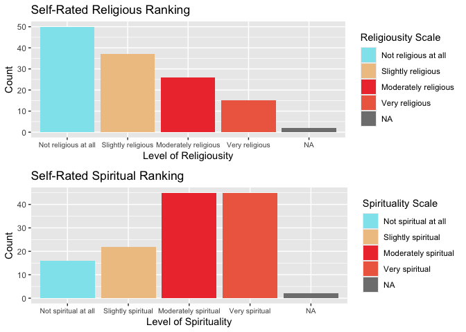

Unveiling the Spiritual Connection to Health
================
Mariela Mendez, Hannah Huang
2024-07-25

### Introduction & Motivation

The CAM and Spirituality, Religiosity dataset, sourced from the
Association of Religion Data Archives (ARDA), examines the impact of
spirituality on health among chronically ill patients from a private
medical clinic in Southampton, UK. This dataset encompasses various
dimensions of spirituality, including spiritual and meditative
practices, personal values, spiritual coping strategies, and religious
support. Additionally, it explores health measures related to
mindfulness and overall coping when facing health challenges. In the
context of modern medicine, which predominantly employs Western
techniques, there is a growing need to consider the contrasting
spiritual approaches found in alternative medicine. The integration of
spirituality into healthcare is often overlooked in contemporary medical
practices. This dataset aims to investigate whether specific spiritual
practices or beliefs correlate with enhanced mental and physical health,
reduced stress levels, or improved coping mechanisms. The insights
derived from this dataset are highly relevant for healthcare
professionals and therapists seeking alternative treatment methods and
strategies outside normative medical practices. The findings could
inform holistic healthcare policies that integrate spirituality into
patient care, influence educational programs on self-care in public
schools, reshape treatment strategies for severely injured patients, and
enhance mental health approaches in workplace settings. By acknowledging
the role of spirituality in overall well-being, this research has the
potential to shape more inclusive and comprehensive healthcare
practices.

### Dataset Collection Methodology: Survey Questionaire

The principal investigators Niko Kohls, Harald Walach, and George Lewish
sent out their questionnaires to a randomized population of patients who
met the following three criteria: undergone treatment within a 3 year
mark, older than the the age of 18, and had a diagnosis of either
migraines, irritable bowel, or chronic fatigue syndrome. The respondents
consisted of 71 cases with chronic fatigue (65%), 29 (27%) individuals
with an irritable bowel syndrome as well as 9 (8%) patients suffering
from migraines, totaling to 130 respondents.

Six hundred questionnaires were originally mailed to the patients. With
a response rate of 18.5%, 111 questionnaires were successfully
completed. The survey questions focused on the impact of patients’
spirituality and their overall physical health. The spiritual topics
range from spiritual experiences, personal values, to private religious
practices and more. As for the health topics, these range from
mindfulness practices to current health issues. The final dataset
consisted of 258 total variables, from 254 initially, and 130
respondents for a better understanding of the subject matter. For this
project’s more focused analysis, the variable count has been reduced to
13 variables. By concentrating on the factors that would best describe a
sample and their relationship with religion/spiritual practices, a more
direct approach towards understanding the correlation between
spirituality and health was developed.

### Defining Chosen Variables

The original data set consists of 130 responses to 258 variables. To
narrow our analysis to the factors that best describe respondents’
spiritual practices and health, 13 variables were chosen in order to
avoid repetitive patterns and create a more cohesive dataset. Within the
13 remaining variables, three categories were created in order to
differentiate between them. The categories consist of: spirituality
and/or religion, effects on an individual’s physical health, and
demographic data.

- For the **spiritual and religious** category, the following variables
  are as defined:
  - *belgdwth* refers to the survey question “I believe in a God who
    watches over me”,
  - *prvtpry* refers to “How often do you pray privately in place?”,
  - *relpersn* refers to “To what extent do you consider yourself a
    religious person?”
  - *sprtprsn* refers to “To what extent do you consider yourself a
    spiritual person?”.
- The **health effects category** contains both physical and
  psychological effects. These variables are:
  - *DISTRS11*: poor appetite,
  - *DISTRS23*: nausea or upset stomach,
  - *DISTRS37*: feeling weak in parts of your body,
  - *DISTRS04*: feelings others are to blame for most of your troubles,
  - *DISTRS16*: feeling lonely,
  - *DISTRS53*: the idea that something is wrong with your mind.
- As for the **personal data category**, the variables chosen are:
  - *gender*: female or male,
  - *mrtlstus*: marital status (single, married, divorced, or widowed),
  - and *denom*: denomination.

#### Rationale for Selecting Variables

Given the abundant amount of original variables, the elected variables
were selected carefully. The variables *belgwth*, *prvtpry*, *relpersn*,
and *sprtprsn* are variables that were chosen to determine the level to
which a participant may be spiritual or religious, determining how
strong the correlation between their spirituality and health would be:

- The variable *belgwth* indirectly questions the participant if they
  believe in a greater existence and if the participant believes that
  greater existence is watching them.
- The variable *prvtpry* aims to see how religious a participant
  actually is outside of church. Oftentimes, individuals want a certain
  image of themselves to be displayed to the public, but private
  practices are a different topic.
- The variables *relpersn* and *sprtprsn* are a self ranking and sets
  how the participant views themselves on a scale from “not at all” to
  “very”.

The next set of variables relate to a participant’s current health
issues. They can be further split into physical and psychological
effects.

- The physical symptom variables were poor appetite (*DISTRS11*), nausea
  or upset stomach (*DISTRS23*), and feelings of weakness in one’s body
  (*DISTRS37*). These variables were selected as they directly related
  to the requirements to the survey study of having irritable bowel or
  chronic fatigue syndrome. While the third indicator was migraines, the
  statements related to them were not as direct as these. So for the
  sake of a focused analysis, irritable bowel and chronic fatigue
  syndrome were preferred.
- The psychological health effects chosen were feelings others were to
  blame for most of one’s troubles (*DISTRS04*), feelings of loneliness
  (*DISTRS16*), and feelings that something is wrong with one’s mind
  (*DISTRS53*). *DISTRS04* was chosen to see if participants would blame
  their problems on an entity rather than themselves while *DISTRS16*
  and *DISTRS53* were elected to see if the level of religiosity or
  spirituality affected how lonely one was or if they felt something was
  genuinely wrong with them.

The last set of variables were demographic variables to get to know the
data set population. These variables include gender, marital status, and
denomination. Ultimately, these variables were chosen to illuminate any
findings on the health relationships between the spiritual and physical
in hopes to offer a shorter but to some extent holistic approach.

Note: While creating our new dataset, certain variables were renamed for
clarity during data analysis as follows:

- *belgdwth* to *godwatches*
- *DISTRS11* to *poor_appetite*,
- *DISTRS23* to *nausea*,
- *DISTRS37* to *weakness*,
- *DISTRS04* to *blameothers*,
- *DISTRS16* to *lonely*,
- *DISTRS53* to *mindwrong*.)

### Getting to Know the Participants

#### Gender Disparity

<!-- -->

The dataset reveals a significant gender disparity, with a predominance
of female respondents. Out of 130 total responses, 112 are from women,
while only 17 are from men. One respondent did not specify their gender.
This notable imbalance raises important considerations regarding sample
representation and potential response bias. The disproportion suggests
that women are more likely to engage in surveys related to spirituality,
religiosity, or health. This could be attributed to higher involvement
in spiritual or religious practices among women, as well as a greater
willingness to disclose personal beliefs and health experiences in
surveys. The limited number of male respondents constrains the ability
to generalize findings to the broader population. Despite this
imbalance, the data provides valuable insights into the relationship
between spirituality, religiosity, and health. The findings contribute
to understanding how these factors influence well-being, particularly in
the context of the human body and its nervous system.

#### Marital Status and Its Implications

<!-- -->

Marital status offers valuable insights into how personal relationships
influence spiritual beliefs and practices. Typically, married
individuals benefit from enhanced social support, which can positively
affect their overall well-being. Spirituality and religiosity often play
a role in strengthening marital bonds, providing both emotional and
practical support, which can, in turn, improve physical health outcomes.
According to the survey, 53% of respondents are married, 27% are single,
19% are divorced, and 1% are widowed. These proportions are generally
consistent with the marriage status distribution in the UK as of 2021
for single and married populations. However, our sample shows a higher
percentage of divorced individuals and a lower percentage of widowed
individuals compared to national averages. This discrepancy may be
attributed to the average age of respondents and the accessibility of
the survey, which could have influenced the representation of widowed
participants. Overall, while the sample is somewhat skewed, it still
provides a reasonable reflection of the married demographic within the
UK population. The findings highlight the significant role that marital
status can play in shaping spiritual practices and their associated
health benefits.

#### R1eligious Denominations of Participants

<!-- -->

In analyzing the religious affiliations of our survey participants, it
was discovered that 50 respondents identified as Protestant, while
nearly 30 participants reported no religious affiliation. This
distribution contrasts with broader religious trends in the UK.
According to the 2021 Census for England and Wales, the largest
demographic identifies as having no religion (46.2%), followed by
Christians at 37.2%. Other religious affiliations include Muslims
(6.5%), Hindus (1.7%), Sikhs (0.9%), Jews (0.5%), and Buddhists (0.5%).

The survey, conducted at a single private medical clinic in Southampton,
may not fully represent the national religious landscape. The local
demographics and the clinic’s geographical location, which may have a
higher concentration of Protestants, could have influenced the
respondent distribution. Furthermore, response bias should be
considered, as individuals more engaged in religious and spiritual
practices might have been more inclined to participate in the survey.

#### Levels of Religiousness and Spirituality

<!-- -->

The survey results reveal a notable distinction between participants’
self-perceived levels of spirituality and religiosity. Approximately 90
respondents identified themselves as moderately to very spiritual, while
around 40 described themselves as moderately to very religious. This
trend indicates that participants generally view themselves as more
spiritual than religious. This distinction is significant for subsequent
analyses of physical and psychological health, as it highlights
different dimensions of personal belief systems. According to sources
such as Harvard Divinity School, Pew Research Center, and Psychology
Today, the key differences between religiosity and spirituality are as
follows:

- Religiosity typically involves structured practices such as observing
  religious holidays, adhering to specific rites and ceremonies,
  following sacred texts, and recognizing the authority of religious
  leaders and institutions.
- Spirituality, in contrast, emphasizes personal experience and
  individual exploration. It is characterized by flexibility and can
  include practices such as meditation, yoga, mindfulness, personal
  reflection, and a connection with nature. Spirituality often draws
  from various cultural and religious traditions and focuses on personal
  growth, universal values such as love, compassion, and
  interconnectedness, and one’s journey in life.

Understanding these distinctions is crucial for interpreting how
spirituality and religiosity may impact overall health and well-being.
The emphasis on spirituality over religiosity among participants may
influence their health outcomes and experiences in different ways.

### Insights and Interpretation

#### Quantifying Health

This study aims to explore the relationship between religious and
spiritual practices and both physical and psychological health. In the
dataset, health variables are coded as factor variables, with symptom
severity categorized into levels: “Not at all,” “A little bit,”
“Moderately,” “Quite a bit,” and “Extremely.” To enable a detailed
statistical analysis, health symptoms are quantified by converting these
categorical variables into numerical values. This quantification
facilitates consistent measurement of health across different respondent
groups, allows for the calculation of average health scores, and
supports the generation of various plots for data visualization and
assessment. This approach preserves the integrity of the survey
responses while providing a rigorous framework for analysis.

#### Physical Health vs. Psychological Health

Before delving into the relationship between spirituality and health, it
is essential to first establish whether a correlation exists between
physical and psychological health. Establishing this relationship is
crucial for comparing the health of different subgroups when assessing
the impact of spiritual and religious practices. Although physical and
psychological symptoms are distinct, physical ailments can lead to lower
quality of life and feelings of loneliness and helplessness, and vice
versa. It is anticipated that there will be at least a modest, if not
significant, correlation between physical and psychological health. This
preliminary analysis will provide a foundation for assessing how
spiritual and religious practices impact overall well-being.

<!-- -->

Further analysis of the data indicates that there is indeed a
correlation between physical and psychological health severity. However,
the strength of this correlation is somewhat limited by the relatively
small sample size of 130 responses, compared to the intended 600. The
majority of participants reported low severity scores on both
psychological and physical health, with scores tending towards zero on a
scale from zero to four, suggesting a generally healthy population. To
gain a more accurate understanding of the correlation’s strength, it
would be beneficial to analyze data from a larger and more diverse
sample, including a higher number of male respondents and individuals
from various religious backgrounds. Despite these limitations, the
identification of a correlation between physical and psychological
health is valuable. It provides a foundation for future analyses and can
inform more integrated approaches in medical solutions that address both
physical and mental health within the healthcare industry.

#### Spiritual vs. Religious - Health Effects

Two variables in the dataset assess respondents’ self-ratings of their
religiousness and spirituality. These self-ratings serve as benchmarks
for evaluating the “religiousness” and “spirituality” of participants.
As previously defined, religion typically involves an institutionalized
system of beliefs and practices, whereas spirituality is characterized
by a personal sense of connection to something greater than oneself.
Despite these distinctions, both dimensions are associated with positive
coping mechanisms that can enhance mental health, which in turn may
improve physical health.

##### Are Spiritual People Religious? Are Religious People Spiritual?

To accurately define the relationship between spirituality and health,
it is essential to first understand how respondents perceive these
concepts and how they classify themselves within the religious and
spiritual domains. This understanding provides a foundational context
for analyzing how these self-perceptions relate to health outcomes.

<!-- -->

The analysis of the relationship between respondents’ self-ratings of
religiousness and spirituality indicates no significant correlation
between these two dimensions. As previously noted, the majority of
respondents identify as spiritual rather than religious. This
distinction underscores a divergence between religiousness and
spirituality within the sample, potentially reflecting the personal
flexibility associated with spirituality compared to the more structured
nature of religious practices.

To fully understand the differences between religious and spiritual
practices, further analysis is needed, particularly focusing on the
daily faith practices and activities of respondents. Overall, the data
reveals no statistical correlation between religious and spiritual
self-ratings. While individuals who self-identified as “very religious”
consistently also identified as spiritual, the same was not necessarily
true for those who identified as “very spiritual.”

##### Does Spirituality/Religiosity Predict Severity of Health Symptoms?

Having clarified the distinction between religiosity and spirituality
and assessed the demographic self-rankings of respondents in these
areas, the next step is to analyze the relationship between
religiosity/spirituality and the severity of health symptoms.

The severity of health symptoms, along with the corresponding health
scores of respondents, is as follows:

##### Overlall Health

| med_health_total | avg_health_total |
|-----------------:|-----------------:|
|        0.8333333 |        0.9322917 |

The analysis of overall health scores reveals that the average score is
0.93, while the median score is 0.83. This indicates that most
respondents have relatively low health symptom scores, with the majority
reporting their overall (physical and psychological) health symptoms as
falling between the categories of “Not at all” and “A little bit.”

The average score of 0.93 suggests that, on average, respondents
experience mild symptoms. However, the median score of 0.83 is slightly
lower, indicating that more than half of the respondents report
experiencing even fewer symptoms. The concentration of responses in the
lower end of the severity scale reflects a generally positive health
status among the sample population. This distribution provides a
baseline understanding of the respondents’ health conditions, which is
crucial for evaluating how religiosity and spirituality may correlate
with their physical and psychological well-being.

##### Physical Scores

| med_phys_health | avg_phys_health |
|----------------:|----------------:|
|       0.6666667 |       0.8723958 |

The analysis of physical health scores shows an average score of 0.87
and a median score of 0.67. The average score of 0.87 indicates that, on
average, respondents report mild to moderate physical health symptoms.
In contrast, the median score of 0.67 suggests that more than half of
the respondents experience even fewer symptoms, reflecting a generally
lower severity of physical health issues for the majority of the sample.
This discrepancy between the average and median scores highlights that
while some respondents report relatively higher physical health
symptoms, a significant portion experiences fewer or less severe
symptoms. The lower median score demonstrates that the majority of
respondents are closer to the lower end of the severity scale,
suggesting a generally favorable physical health status within the
sample.

##### Psychological Health Scores

| med_psych_health | avg_psych_health |
|-----------------:|-----------------:|
|        0.6666667 |        0.9921875 |

The analysis of psychological health scores reveals an average score of
0.99 and a median score of 0.67. The average score of 0.99 indicates
that, on average, respondents report mild psychological symptoms. This
average value provides insight into the general level of psychological
distress experienced by the participants. In contrast, the median score
of 0.67 suggests that more than half of the respondents experience
psychological symptoms that are less severe than this midpoint value.
The median represents the central point of the data, indicating that the
majority of participants report relatively lower levels of psychological
distress. The discrepancy between the average and median scores
illustrates that while the average score is slightly higher, indicating
some variability in symptom severity, the median score reflects that a
significant portion of respondents experience minimal distress. This
variation suggests that, overall, the psychological health of the
respondents is favorable, with many experiencing lower levels of
psychological symptoms.

#### Health Severity Score Summary

In summary, the average overall health severity score is 0.93, while the
median overall health severity score is 0.83. The average score,
calculated as the mean of all responses, reflects the general level of
health severity reported by participants. The median score, determined
as the midpoint of the ordered responses, indicates that 50% of
respondents experience health symptoms below this value, highlighting a
slightly lower severity for the majority. The median scores for both
physical and psychological health are the same at 0.67, which suggests
that half of the respondents report physical and psychological symptoms
of similar severity. However, the average psychological health score is
higher at 0.99 compared to the average physical health score of 0.87.
This indicates that, on average, respondents report slightly more severe
psychological symptoms than physical symptoms. Overall, most respondents
report low levels of both physical and psychological symptoms, with
scores averaging less than 1 on a scale from 0 to 4. This pattern shows
that while the majority experience mild symptoms, psychological symptoms
are rated as somewhat more severe than physical symptoms.

##### Religious Self-Ranking and Health Severity

<!-- -->

An assessment of the relationship between religious self-ranking and
overall health severity reveals no significant correlation. Individuals
with higher overall health severity scores generally reported lower
levels of religiosity. Specifically, those identifying as “Very
religious” had overall health severity scores not exceeding 2,
suggesting that their symptoms impacted their well-being only minimally.
Data analysis indicates that the majority of respondents reported
overall health severity scores below 1, as shown by the graph where most
data points cluster at the lower end. To comprehensively understand the
relationship between religiosity and health severity, a larger sample
with a wider range of health severity levels is necessary.

<!-- -->

In contrast to religiosity, no significant relationship is observed
between personal spirituality and overall health severity. The data
shows that respondents who rated themselves as highly spiritual
generally reported lower overall health severity scores, with most
scores below 1. The graph indicates that there is no discernible trend
linking higher levels of spirituality with increased health severity.

#### How Does Marital Status Affect Health Symptoms?

Marital status can significantly influence an individual’s spiritual
beliefs and practices, and thereby impact emotional and physical
well-being. Marriage often reinforces spiritual and religious values,
fostering emotional support and enhancing the quality of life.
Understanding the relationship between marital status and health
provides valuable insights into how the presence or absence of a
supportive partner can affect overall health and well-being. Married
individuals typically benefit from a robust emotional support system,
which can contribute to better health outcomes by mitigating stress and
providing a stable foundation for both physical and mental health.
Conversely, those who are single, divorced, or widowed may experience
different levels of support and thus face varying health challenges.By
analyzing the relationship between marital status and health symptoms,
it is possible to gain a deeper understanding of how personal
relationships and emotional support systems influence health. This
analysis helps in identifying how different marital statuses correlate
with health symptoms, potentially guiding interventions and support
strategies tailored to individuals’ relational contexts.
<!-- -->

Combining both physical and psychological health metrics, marital status
emerges as a significant predictor of overall health severity. Married
respondents reported a notably lower average health severity score,
reflecting less severe health symptoms compared to their single and
divorced counterparts. Specifically, married individuals had a median
severity score of approximately 0.5, which falls between the “Not at
all” and “A little bit” ranges. In contrast, single and divorced
respondents both reported median scores around 1, corresponding to the
“A little bit” range. Given that the median overall health severity
score for the entire sample was below 1, these findings are particularly
striking. Single and divorced individuals rated their overall health
more severely than the average participant, suggesting that marital
status plays a crucial role in health outcomes. The data indicates that
married individuals are more likely to report less severe health
symptoms, which implies that marital status can be a useful predictor of
health severity. Further analysis is needed to explore the differences
in ratings between physical and psychological symptoms, to better
understand how marital status influences various dimensions of health.

##### Marital Status and Health Symptoms - Physical vs. Psychological

The analysis has demonstrated that marital status is a predictor of
overall health severity, with married individuals consistently reporting
lower average health severity scores compared to single and divorced
respondents. This overall health severity score encompasses a range of
symptoms, including poor appetite, nausea, weakness, feelings of blame,
loneliness, and concerns about mental health. While marriage appears to
significantly reduce the perception of psychological symptoms such as
loneliness and feelings of blame—likely due to the emotional support
provided by a marital partner—its impact on physical symptoms like
nausea and weakness is less clear. The emotional and psychological
benefits of marriage may not directly address physical health issues. To
gain a comprehensive understanding of how marital status influences
health, it is crucial to distinguish between the impacts on physical
versus psychological symptoms. This comparison can shed light on how the
religious and spiritual dimensions of marital relationships contribute
to the management and experience of both physical and psychological
health symptoms. Further analysis in this area will provide deeper
insights into the multifaceted role of marital status in health
outcomes.

<!-- -->

The patterns observed in physical and psychological health severity
scores reflect the overall health severity trends, with married
individuals consistently reporting less severe health symptoms compared
to their single and divorced counterparts. On average, respondents
indicated that their psychological symptoms were more severe than their
physical symptoms, a trend that was consistent across all marital status
categories. However, marital status alone does not predict whether
psychological health is more significantly affected than physical
health, or vice versa. This lack of distinct prediction may be
attributed to the strong correlation between physical and psychological
health, or the possibility that the emotional support offered by
marriage mitigates both types of symptoms. To fully understand the
interplay between marital status, spiritual and religious practices, and
their combined effects on health outcomes, further research is
necessary.

### Conclusion

After narrowing the dataset down from 254 to 13 variables that describe
the spiritual, religious and health-related factors among survey
respondents, a few key takeaways have come to light. Comparing health
symptoms amongst different demographics revealed that the majority of
respondents reported low levels of both physical and psychological
symptoms. Physical and psychological health are correlated, contrary to
the current medical standard of treating disease over illness. This
highlights the interconnected nature of overall health and how this
concept of holistic treatment should be implemented into modern
medicine. Additionally, there is no significant correlation between
one’s level of religiosity and spirituality. Survey respondents tended
to rank themselves as more spiritual and less religious. It remains
important to consider the distinction between the two while implementing
their practices in the process of healing. Neither religiosity nor
spirituality seemed to demonstrate a significant impact on the health of
the respondents. However, they can positively influence overall health
through development of coping techniques and emotional support. Married
individuals reported better health outcomes compared to single or
divorced individuals, suggesting that emotional and social support in
marriage helps reduce health symptoms. Considering the interplay between
marriage and religious/spiritual practice, this finding supports the
idea that demonstrating faith can contribute to alleviating the symptoms
of chronically ill patients. It is clear that social factors that affect
an individual’s mental strength can play a larger role in physical
health than expected. These takeaways are significant because they
emphasize the need for physicians and caretakers to gain a more holistic
view of their patients in treating both physical and mental health. In
today’s Western approach to medicine, treatments are often direct,
focusing on prescribing medications and expecting quick recoveries.
However, this approach may overlook the significant impact of spiritual
practice on mental health and physical healing. This dataset suggests
that weaker mental health can hinder recovery, highlighting the
importance of addressing both mental and physical health in medical
care. Introducing faith-based practice may serve as an alternative in
treating medical ailments, especially those affecting overall quality of
life through chronic pain and illness. In addition, seeing the direct,
positive effects on spirituality and religion on one’s overall health
through survey responses, this amplifies the need for institutions and
establishments to accommodate those who routinely partake in their
religious practices, for example those who pray on a daily basis. If one
is in touch with their culture and spirituality and are suddenly
stripped of their routine and comfort in prayer or meditation, this may
take a negative toll on both their mental and physical health. On the
other hand, for those who may not have much experience in spirituality,
programs can be offered to encourage patients to turn their nervous,
stressed energy into hoping for positive change in their lives,
resulting in a healthier mindset that will eventually lead to a more
successful recovery. Further research with more participants and
variables is needed to pinpoint specific goals and direct efforts in the
effort to effectively integrate faith-based practices in the process of
healing.
