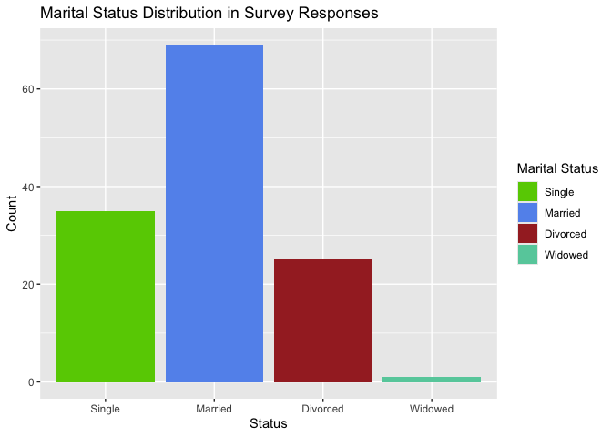

Unveiling the Spiritual Connection to Health
================
Mariela Mendez, Hannah Huang
2024-07-25

### Complementary and Alternative Medical (CAM) and Spirituality, Religiosity Survey

The CAM and Spirituality, Religiosity survey was given to chronically
ill patients who were randomly chosen from a patient database at a
private medical clinic in Southampton, UK. To be a participant for the
survey, individuals were required to (1) have recent treatment within
the last three years, (2) have a diagnosis of either migraines,
irritable bowel, or chronic fatigue syndrome, and (3) have an age
greater than 18. Six hundred questionnaires were originally mailed to
the patients, yet there was a response rate of 18.5%, with 111
successfully completed questionnaires. The survey aims to explore the
impact of spirituality on health. The spiritual topics range from
spiritual experiences, personal values, to private religious practices
and more. As for the health topics, these range from mindfulness
practices to current health issues. The following data is sourced from
the Association of Religion Data Archives, www.theARDA.com, and was
collected by principal investigators Niko Kohls, Harald Walach, and
George Lewish. The original data set consists of 254 variables and 111
participants, but for better comprehension, the ARDA decided to add
variables and responses to include 258 total variables and 130
respondents. However, for the purposes of this analysis, the variable
count has been reduced to 13 variables. While this is a much shorter
data set, the chosen variables create a more direct approach. A concise
data set facilitates clearer interpretation of results without one being
overwhelmed by excessive data.

### Motivation

Understanding the relationship between spirituality and health is an
important aspect in well-being. In medical environments, especially
those dominated by Western medicine, spirituality’s impact on health is
often disregarded. With this data set, investigators are able to explore
how spirituality affects various sectors of health and overall
well-being. Via analysis, patterns or correlations can be linked. One
could uncover whether certain spiritual practices or beliefs are
associated with better mental health, reduced stress, or improved coping
mechanisms. In return, these patterns are relevant to healthcare
providers or therapists looking to integrate effective strategies into
their treatments. Notably, findings could influence policies related to
holistic healthcare approaches that acknowledge the role of spirituality
in patient well-being.

<!-- ```{r}
nrow(camdata)
ncol(camdata)
# Our data set consists of 130 responses to 258 variables!
``` -->

### Defining Variables

The original data set consists of 130 responses to 258 variables!
Narrowing the focus for a more direct approach, 13 variables were chosen
instead. Three categories were made in order to create a distinction
between these chosen variables. The categories are as follows:
spirituality/religious, health effects, and personal data. For the first
category, the variable *belgdwth* refers to the survey question “I
believe in a God who watches over me”, *prvtpry* refers to “How often do
you pray privately in place?”, *relpersn* refers to “to what extent do
you consider yourself a religious person?”, and *sprtprsn* refers to “to
what extent do you consider yourself a spiritual person?”. The health
effects category contains both physical and psychological effects. These
variables are *DISTRS11*: poor appetite, *DISTRS23*: nausea or upset
stomach, *DISTRS37*: feeling weak in parts of your body, *DISTRS04*:
feelings others are to blame for most of your troubles, *DISTRS16*:
feeling lonely, *DISTRS53*: the idea that something is wrong with your
mind. As for the personal data category, the variables chosen are
*gender*: female or male, *mrtlstus*: marital status (single, married,
divorced, or widowed), and *denom*: denomination. COME BACK TO EXPLAIN
REASONING FOR SELECTING THESE VARIABLES!!

### Cleaning The Data

We will create a new data frame incorporating our variables of interest.

### Getting to Know the Participants

#### Gender

<!-- -->

\[Analysis here\] \#### Marital Status
<!-- -->

\[Analysis here\]

#### Denomination

<!-- -->

\[Anaylis here\]

#### How Religious or How Spiritual


\[Analysis here\]

### Analysis

\####Scatterplot

Plans: huge difference in gender (women 112\> men 17) most are not
religious (50) but very spiritual (45) 90 nothing is wrong with mind 50
protestant most are married most never have private practice

want to create and analyze charts/graphs (maybe more) spiritual person
w/ psychological problems vs religious spiritual person w/ physical
problems vs religious mrtstus effect on health problems belgdwth effect
on health problems
